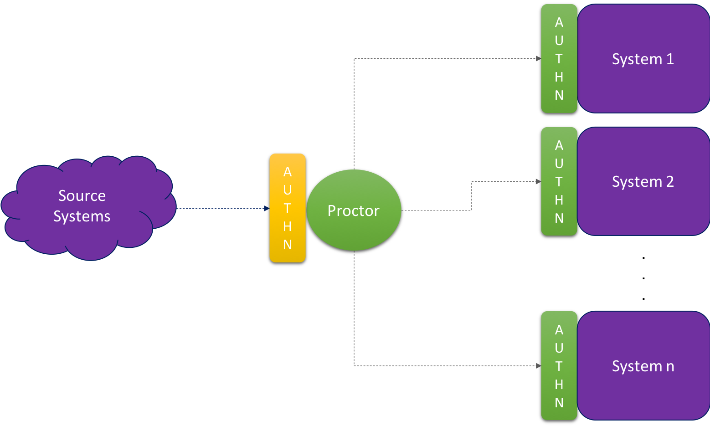

# Overview

As part of its advisory services arm, Bee Projects often builds integrations between various commercial and/or opensource products.

A common and recurring theme across these integrations is enabling authentication between any middleware we develop and the source and/or destination systems we connect with.

We often integrate with the same off the shelf product across every client. This authenticator plugin project allows us to generecise the authentication mechanism using a plug-in model that enables us to reuse such capability across different environments.

